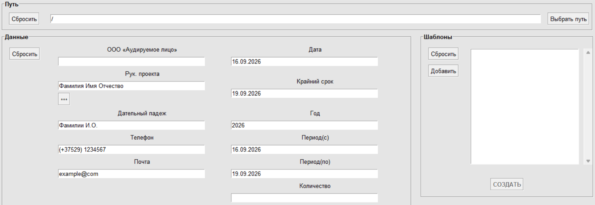

# Document Automation Tool (Tkinter & python-docx)


A modular desktop GUI application built for automated templating and batch generation of audit inquiry documents (`.docx`).

> **Historical Context:**  
> This project was designed and developed at age 14 as a commercial workflow automation tool for an audit consultancy practice. Preserved in its original flat-file architecture to demonstrate early OOP foundations, code hygiene, and progression toward computational engineering.

---

## Preview



---

## Key Features

- **Dynamic Word Templating:** Scans and replaces text placeholders in `.docx` body paragraphs and nested tables based on font RGB color matching (`#00B050` / Standard Green).
- **Relational Registry Support:** Automatically populates project auditor credentials from an underlying CSV registry (`Аудиторы.csv`) with grammatical declension handling (Dative case).
- **Persistent Configuration:** Stores session state, folder targets, and timestamp parameters across runs using JSON configs (`info.json`, `settings.json`).
- **Resilient GUI Architecture:** Built with pure `tkinter` using hierarchical class decomposition (`Grid`, `Buttons`, `Path`, `Fields`, `Saved`, `Data`).

---

## Tech Stack

- **GUI Framework:** `tkinter` (Standard Library)
- **Document Processing:** `python-docx`
- **Data Serialization:** `json`, `csv`
- **Packaging:** PyInstaller (stand-alone executable deployment)

---

## Quickstart

### 1. Clone the repository
```bash
git clone https://github.com/[твой_username]/doc-automation-tkinter.git
cd doc-automation-tkinter
```

### 2. Install dependencies
```bash
pip install -r requirements.txt
```

### 3. Run application
```bash
python main.py
```

---

## Usage Workflow

1. **Set Destination:** Specify or browse the output directory for generated files (defaults to `./Готовые документы/`).
2. **Fill Audit Parameters:** Input organization details, period dates, or select the lead auditor via the `◦◦◦` lookup button.
3. **Choose Templates:** Select one or multiple template files from the `Шаблоны/` list.
4. **Generate:** Click **СОЗДАТЬ** to execute batch placeholder replacement and save ready `.docx` files.
